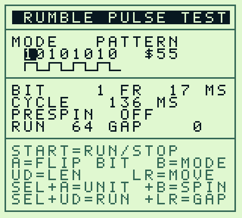
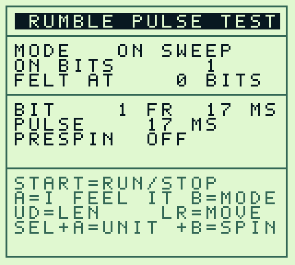

# rumble-pulse.gb

A 32 KiB Game Boy ROM that plays arbitrary rumble patterns on demand, for
finding what a cartridge motor responds to. The built ROM is checked in beside
this file.

Header is type `$1C` (MBC5 + RUMBLE), 32 KiB, no SRAM. Rumble is bit 3 of the
RAM bank register at `$4000`.

The repository [README](../README.md) covers which mode produces which of the
three numbers [Set-PinballRumble.ps1](../Set-PinballRumble.ps1) takes, and how
to replay a patched pattern here before flashing it.

## Screen

| PATTERN                                       | ON SWEEP                                       |
| --------------------------------------------- | ---------------------------------------------- |
|  |  |

The pattern row is the eight bits with the byte in hex, so the setting on
screen matches the byte a patch would write. Beneath it the same pattern is
drawn as a square wave, so a run of set bits reads as one wide pulse.

In the sweep modes those rows become the step counter and `FELT AT`, `CYCLE`
becomes `PULSE` or `REST` showing the current step in milliseconds, and the
`RUN`/`GAP` row disappears, because burst length only governs PATTERN.

## Controls

| Input               | Action                                                   |
| ------------------- | -------------------------------------------------------- |
| Left / Right        | Move the cursor along the 8-bit pattern                  |
| A                   | Toggle the bit under the cursor (in sweeps: "I feel it") |
| Up / Down           | Bit length, auto-repeats when held                       |
| B                   | Cycle mode                                               |
| SELECT + A          | Toggle unit (FR / MS)                                    |
| SELECT + B          | Toggle PRESPIN                                           |
| SELECT + Up/Down    | Burst length in bits, 0 = run until stopped              |
| SELECT + Left/Right | Rest between bursts, 0 = one burst then stop             |
| START               | Run / stop                                               |

SELECT on its own does nothing; it is a modifier. While running, START or B
stops, A marks the current sweep step into `FELT AT`.

## Units

**FR**, 1 to 16 frames per bit, timed off VBlank. A frame is 16.742 ms on a DMG
or GBC, and this is the only cadence a real game's frame loop can produce, so
use it for anything meant to be patched back into a game. Super Game Boy clocks
the whole system faster; the caveats below have the number.

**MS**, 1 to 99 ms per bit, timed by the hardware timer at 4096 Hz. Sub-frame
pulses work here, for the separate question of where the motor's physical
threshold sits.

## Modes

**PATTERN** plays the eight edited bits, least significant first, one bit per
`BIT` length, for `RUN` bits. The leftmost digit on screen is bit 0 and the
first bit played, matching the order the game rotates the byte. Boot defaults
are the game's options-screen demo: `$55`, 1 frame per bit, 64-bit burst.

**PRESET** steps through stored configurations with Up/Down, applying each live.
START plays it, A hands the values to PATTERN for editing. The first seven carry
Pokemon Pinball's shipped pattern and duration; the last three are calibration
references.

The values come from the disassembly. Four of the names do too: WALL HIT,
BUMPER, OPTION DEMO and PIKA SAVE. GENGAR BONUS, SLOW TICK and SPARSE TICK are
labels for sites the disassembly leaves unnamed, so treat those three as
descriptions of the waveform rather than of where it fires.

| Preset       | Pattern | RUN  | GAP |
| ------------ | ------- | ---- | --- |
| WALL HIT     | `$05`   | 8    | 16  |
| BUMPER       | `$FF`   | 3    | 0   |
| GENGAR BONUS | `$33`   | 8    | 0   |
| SLOW TICK    | `$11`   | 8    | 0   |
| SPARSE TICK  | `$01`   | 8    | 0   |
| OPTION DEMO  | `$55`   | 64   | 0   |
| PIKA SAVE    | `$FF`   | 96   | 0   |
| SHORT BLIP   | `$FF`   | 1    | 0   |
| SOLID REF    | `$FF`   | cont |     |
| HALF DUTY    | `$0F`   | cont |     |

**RUN / GAP** set burst length in bits and the rest between bursts. `RUN 0`
shows `CONT` and loops until stopped; `GAP 0` plays one burst and stops.
Burst length changes how a pattern feels: an ERM takes a few hundred
milliseconds to wind up, so a short burst quits while still climbing. Compare 64
against `CONT` before reading anything into a short-burst result.

**ON SWEEP** fires an isolated pulse four times per step with a 1 s gap,
starting at 1 bit and growing one bit per step: 17, 34, 50, 67 ms at the
default. A marks the first step felt. Wraps at 32. The full second between
pulses lets the motor stop, so each pulse is a clean cold start.

**OFF SWEEP** is the inverse, for rest tolerance. The motor runs 8 bits on, then
`N` bits off, cycled 8 times per step, `N` growing one bit at a time. Press A
when the gap first becomes perceptible: the longest rest the motor coasts
through before it drops.

**PRESPIN** runs the motor 250 ms, pauses 30 ms, then starts. Off measures the
cold-start threshold, on measures sustain, and those are different numbers:
three frames of continuous current breaks static friction where one does not,
but once the mass is turning it coasts through one-frame gaps. Ignored in OFF
SWEEP, which is already spinning.

## Building from source

Python 3 only; Pillow is needed just for the screenshot renderer.

```text
python3 src/build.py    # -> rumble-pulse.gb
python3 src/test.py     # boots it headless, asserts the rumble register timings
python3 src/render.py   # -> screenshots/shot_*.png straight out of the emulated VRAM
```

Each resolves its output path from its own location, so the working directory
does not matter.

| File            | Role                                                                                                    |
| --------------- | ------------------------------------------------------------------------------------------------------- |
| `src/build.py`  | The ROM: layout, modes, timing, tile map, header and checksums                                          |
| `src/sm83.py`   | SM83 opcode emitter: labels, local-label scoping, fixups                                                |
| `src/font.py`   | 5x7 glyphs at tiles `$00-$3F`, box/wave at `$40-$4F`, inverted at `$50-$8F`, dim at `$90-$CF`, all 2bpp |
| `src/emu.py`    | Headless SM83 interpreter covering the opcode subset the ROM uses                                       |
| `src/test.py`   | Boots the ROM, drives the buttons, asserts the rumble register timings                                  |
| `src/render.py` | Renders the tile map to PNG, for checking layout without hardware                                       |

`emu.py` logs every write to `$4000` with a cycle timestamp, so `test.py`
measures pulse widths to the microsecond and asserts them against known values.
Run it after changing a delay path: it exits non-zero and names the segment that
moved, before anything is flashed.

The `CYCLE` figure on screen is derived from the rounded per-bit ms, so at 3
frames it reads 400 where the true value is 402. Display only; playback is
exact.

### Changing things

- **Layout**: the `draw_all` section near the bottom of `build.py`. `pstr`,
  `pdim`, `pnum` and `ldhl` take tile coordinates; the frame is drawn once at
  init by `draw_frame`, with section rules at rows 2, 6 and 11.
- **Glyphs**: the `G` dict in `font.py`, 5 columns by 7 rows. Tiles are
  generated for ASCII `$20-$5F` in four variants.
- **Timing**: `delay_one_bit` picks between the VBlank path (frames) and the
  timer path (milliseconds). `to_ticks` converts ms to 4096 Hz ticks.
- **New opcodes**: add the emitter method to `sm83.py` and the matching case to
  `emu.py`, or `test.py` stops with `unhandled opcode`.

## Caveats

- A plain MBC5 flash cart with no motor runs this silently.
- Super Game Boy clocks the whole system about 2.4% fast (61.17 Hz, 16.35 ms per
  frame), so numbers taken there will not match a DMG or GBC.
- Thresholds move with battery voltage. Record the supply, or two sessions
  cannot be compared.
- Carts drive the motor through a transistor with its own turn-on behavior, so
  a reading covers the whole cart rather than the bare motor.
